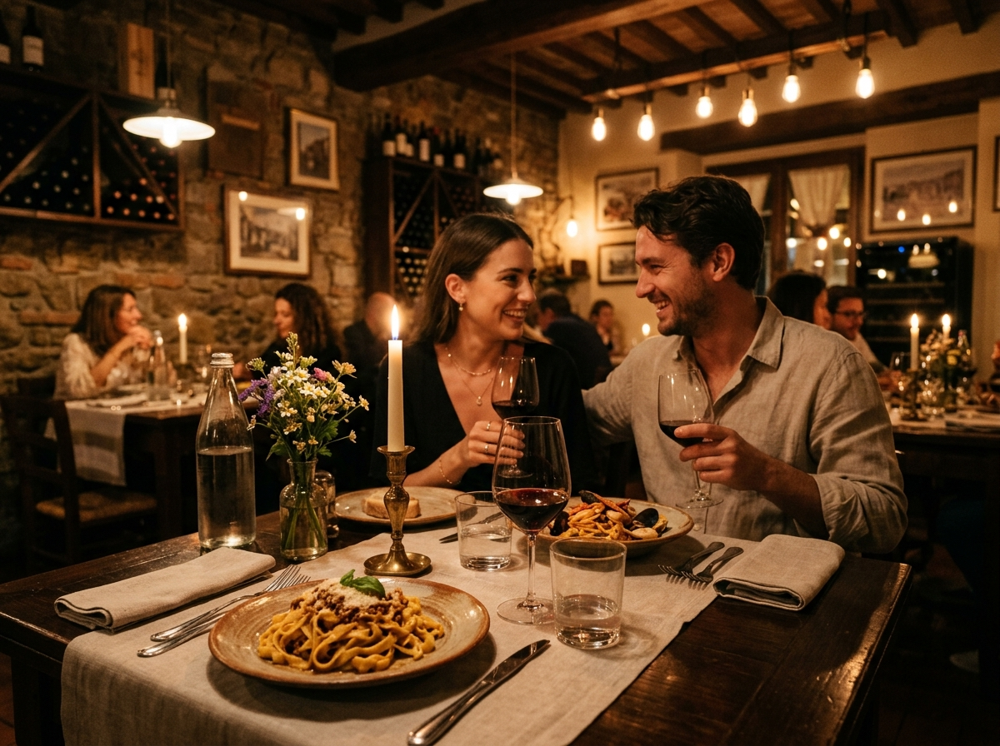

# 💌 DatePlanner - 감성 데이트 초대장

> 회원가입 없이 10초 만에 만드는 세련된 데이트 코스 초대장 🌿

[](https://gksxogksxo1001-sketch.github.io/Date/)



---

## ✨ 서비스 소개

**DatePlanner**는 회원가입/로그인/서버 없이 누구나 감성적인 데이트 초대장을 만들고, 카카오톡이나 링크로 상대방에게 전달할 수 있는 **100% 무료 정적 웹 앱**입니다.

상대방은 전달받은 링크를 열면 **인스타그램 스토리처럼** 데이트 코스를 한 장씩 넘겨보며 확인하고, 수락하거나 코스 조정을 요청할 수 있습니다.

---

## 🚀 주요 기능

| 기능 | 설명 |
|------|------|
| ⚡ **카카오 1초 간편 로그인** | 복잡한 가입 없이 카카오 계정 원클릭 연동 및 프로필 관리 |
| 🗄️ **내 데이트 보관함** | 내가 만든 초대장 자동 보관, 원클릭 재공유/링크복사/삭제 |
| 📝 **비회원 초대장 생성** | 회원가입 없이도 즉시 데이트 코스를 작성하고 초대장 생성 |
| 🗺️ **다단계 코스 구성** | 1차 맛집 → 2차 카페 → 3차 야경 등 자유로운 코스 추가/삭제 |
| 📷 **갤러리 사진 첨부** | 코스별 최대 3장의 사진을 내 갤러리에서 업로드 (자동 압축) |
| 🎨 **3가지 감성 테마** | Warm Cozy / Romantic Rose / Midnight Navy 테마 선택 |
| 📖 **스토리 뷰어** | 인스타그램 스토리 스타일의 카드뉴스 페이저로 코스 확인 |
| 💖 **수락 & 폭죽 연출** | 수락 버튼 클릭 시 로맨틱 하트/꽃가루 Confetti 애니메이션 |
| 📸 **카드 이미지 저장** | 초대장 카드를 고화질 PNG 이미지로 다운로드 |
| 💬 **카카오톡 공유** | Kakao JS SDK 연동 피드 카드 1클릭 전송 |
| 🔗 **URL 토큰 공유** | 서버 없이 Base64 URL 토큰으로 데이터 전달 |
| 🔄 **코스 조정 요청** | 커스텀 드롭다운으로 특정 코스 변경 메시지 전달 |

---

## 🛠️ 기술 스택

- **Frontend**: HTML5 + Vanilla JavaScript + Vanilla CSS
- **Design System**: Glassmorphism / CSS Custom Properties
- **Fonts**: [Outfit](https://fonts.google.com/specimen/Outfit) + [Pretendard](https://fonts.google.com/specimen/Pretendard)
- **Icons**: [FontAwesome 6](https://fontawesome.com/)
- **Libraries**:
  - [canvas-confetti](https://github.com/catdad/canvas-confetti) - 축하 파티클 애니메이션
  - [html2canvas](https://html2canvas.hertzen.com/) - DOM → PNG 이미지 캡처
  - [Kakao JS SDK](https://developers.kakao.com/docs/latest/ko/javascript/getting-started) - 카카오톡 공유
- **Hosting**: GitHub Pages (무료)
- **Data**: Stateless (서버/DB 없음, URL Token + LocalStorage)

---

## 📂 프로젝트 구조

```
DATE/
├── index.html          # 메인 HTML (SPA)
├── app.js              # 핵심 JavaScript 엔진
├── style.css           # 전체 스타일시트
├── assets/             # 이미지 에셋 (파비콘, 샘플 사진)
│   ├── favicon.png
│   ├── restaurant.jpg
│   ├── cafe.jpg
│   └── nightview.jpg
├── doc/                # 프로젝트 문서
│   ├── CHANGELOG.md    # 변경 이력
│   ├── requirements/   # 요구사항 명세서 (PRD)
│   ├── architecture/   # 시스템 아키텍처 설계서
│   └── ui-ux/          # 화면 설계서 & 디자인 시스템
└── .agent/             # AI 에이전트 규칙 & 워크플로우
```

---

## 🌐 라이브 데모

👉 **[https://gksxogksxo1001-sketch.github.io/Date/](https://gksxogksxo1001-sketch.github.io/Date/)**

---

## 📄 라이선스

이 프로젝트는 개인 프로젝트로 자유롭게 참고하실 수 있습니다.
