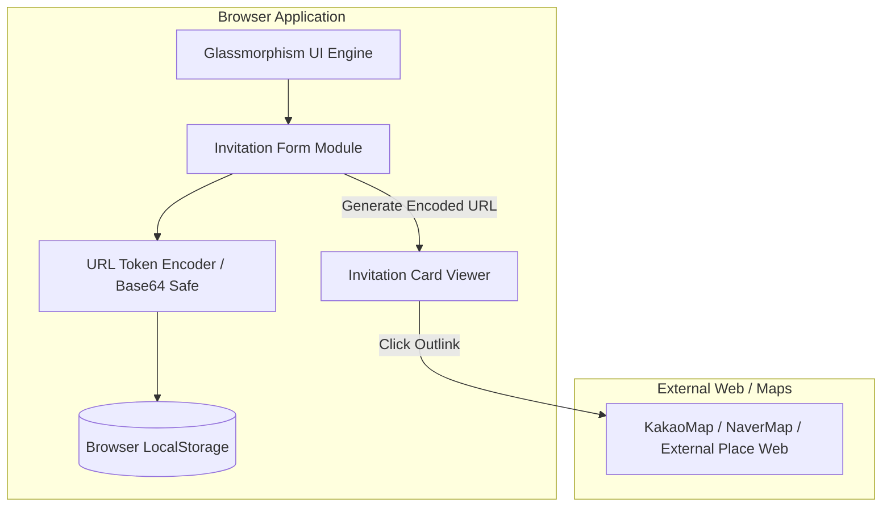

# 하이레벨 시스템 아키텍처 설계서 (HLD: High-Level Design)

## 1. 시스템 개요 및 아키텍처 목표
본 시스템은 **비회원 기반 데이트 신청 방(초대장) 생성 및 공유 웹사이트**입니다. 사용자의 회원가입 장벽을 없애고 10초 이내에 초대장을 완성하여 전달할 수 있도록 무상태(Stateless) 클라이언트 인코딩 구조와 로컬 지속성을 결합한 아키텍처를 적용합니다.

---

## 2. 하이레벨 시스템 다이어그램 (System Architecture Diagram)

---

## 3. 핵심 아키텍처 구성 요소 (Core Components)

1. **Client UI Layer (HTML5 + Vanilla CSS & JS)**:
   - **Glassmorphism & Romantic UI**: 핑크 파스텔 & 로맨틱 테마 디자인.
   - **Form State Manager**: 장소, 약속 일시, 예상 예산, 가게 URL, 초대 메시지를 실시간으로 추적 및 검증.
2. **Stateless URL Encoder / Decoder Module**:
   - 회원가입 DB 서버 구축 없이도 초대장의 모든 데이터(장소, 시간, 예산, 가게링크 등)를 URL Safe Base64 / JSON-Stringify 인코딩하여 URL 파라미터(`?card=...`) 형태로 생성.
   - 데이터 무결성을 위해 유효성 검사 및 인코딩/디코딩 예외 처리 제공.
3. **External Outlink Resolver**:
   - 사용자가 입력한 맛집/카페/장소 외부 웹 페이지 URL을 안심하게 새 탭(`target="_blank" rel="noopener noreferrer"`)으로 안전하게 연동.
4. **Local Fallback Storage**:
   - 생성자(신청자) 본인의 브라우저에 최근 생성한 초대장 이력을 저장하여 재확인 가능하도록 지원.

---

## 4. 기술 스택 및 수석 아키텍트 Trade-off 분석

| 영역 | 선택한 기술 | 선택 사유 및 Trade-off 분석 |
| :--- | :--- | :--- |
| **Frontend** | Vanilla JS + Modern HTML5/CSS3 | 별도의 무거운 프레임워크 구축 없이 순수 웹표준으로 극강의 로딩 속도와 모바일 호환성 확보. |
| **State & Data** | URL Hash/Query Parameter Encoding | **Trade-off**: DB 서버 비용 0원, 회원가입 절차 완전 제거 ➔ 데이터 크기 증가 시 URL이 길어질 수 있으나, 압축 및 인코딩 알고리즘 적용으로 최적화. |
| **Style System** | CSS Flex/Grid + Custom Tokens | CSS 변수를 활용한 파스텔 & 딥 로즈 글래스모피즘 디자인 시스템 구축. |
| **Outlink handling**| Standard Web Security Linker | 외부 가게 지도/포털/블로그 링크 안전 이동 처리. |
